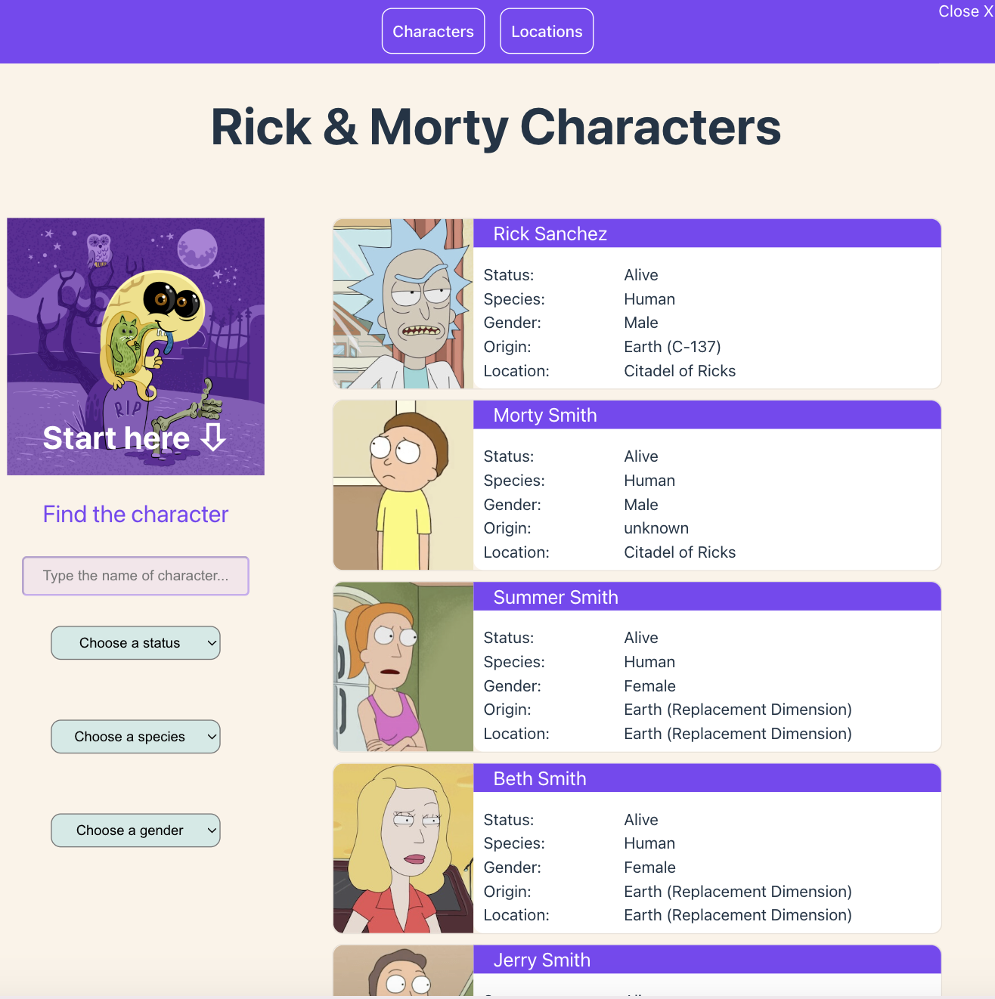

# Rick-Morty App - Test task

Task: to develop single page web application, which displays characters and locations from Rick&Morty universe. 

# Subtasks: 
- responsive menu;
- pagination;
- router;
- filtering;
- query params.

# Dependencies:

babel/eslint-parser:

babel/preset-react
    
axios
    
query-string
    
react
    
react-dom
    
react-redux
    
react-router-dom
    
redux

